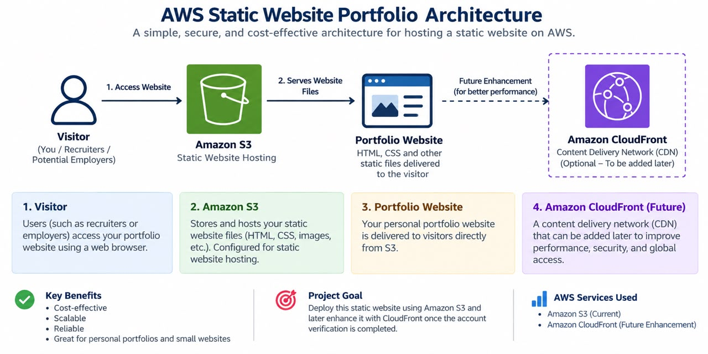

# Chichi's AWS Cloud Portfolio ☁️

Welcome to my AWS Cloud Portfolio.

This project showcases my practical learning journey in cloud computing and Amazon Web Services (AWS), with a focus on building and documenting simple cloud-based solutions.

## 👩🏽‍💻 About Me

I am a Customer Service and Administrative Professional transitioning into Cloud Computing.

I am currently developing my AWS skills and building practical projects to strengthen my understanding of cloud services, architecture, security, and cost management.

## ☁️ AWS Skills

- Amazon S3
- Amazon EC2
- AWS IAM
- Amazon CloudWatch
- AWS CloudFormation
- AWS Billing & Cost Management

## 🚀 Project 1: AWS Static Website

A static portfolio website designed for hosting using Amazon S3.

### Architecture

Visitor → Amazon S3 → Static Website

### Technologies & Concepts

- HTML
- CSS
- Amazon S3
- Static website hosting
- Cloud architecture
- AWS cost awareness

### Current Status

In Progress 🚀

### Future Enhancement

Amazon CloudFront will be added as a future enhancement when account verification is completed.

## 📚 What I Am Learning

- AWS Cloud fundamentals
- Cloud security and the shared responsibility model
- Identity and Access Management (IAM)
- AWS pricing and cost management
- Basic cloud architecture
- AWS core services

## 🎯 Goal

To build practical cloud projects and transition into a cloud-focused career while continuing to develop my technical skills.

---

*Built while learning AWS ☁️*
